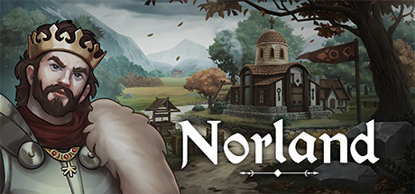

# Norland Demo Unlocker

[](https://github.com/saveroo/norland-demo-unlocker/actions/workflows/build.yml)

**Note: This project is for educational purposes only. Please support the developers by purchasing the full version once it's available.**

A command-line utility (patcher) for unlocking the demo restriction of the game "Norland - Story Generating Strategy," allowing users to experience the full gameplay beyond the limited 20 in-game days.

!

Steam Page: [Norland: Story Generating](https://store.steampowered.com/app/1857090/Norland/)

**Note: This project is for educational purposes only. Please support the developers by purchasing the full version once it's available.**

## Description

The Norland Demo Unlocker is a Go application designed to patch the demo version of "Norland - Story Generating Strategy" to remove the restriction of only being able to play for 20 in-game days. The demo restriction often limits the player's experience and exploration of the game's features. With this unlocker, users can fully immerse themselves in the game without any time limitations during the demo.

## Motivation

Reverse engineering, an essential skill in software development and cybersecurity, is the process of analyzing and understanding a program's structure and behavior to gain insights into its functionality. The Norland Demo Unlocker project was motivated by the desire to explore the fascinating world of reverse engineering and learn more about the internals of software applications.

By unlocking the demo restriction of "Norland - Story Generating Strategy," we aimed to delve into the mechanics of the game's limitations and understand how they were enforced. Reverse engineering allowed us to dissect the binary file, examine its assembly instructions, and identify the specific code responsible for the time restriction. This journey of discovery has been both challenging and rewarding, providing valuable insights into low-level programming concepts.

## Compatibility
Platform:
```
Windows (AMD64)
```
Compatible Version:
```
0.2912.3227.0
```
Target Binary SHA-256 Sum:
```
d063af2e8d841df250a9f96146a34da710fdf78b10f1e1d103c8c981f41fcf66
```

## Features

- Removes the 20 in-game days restriction from the demo version, allowing unlimited playtime.
- Utilizes minor shellcode patching technique to modify the game's binary.
- Creates a backup of the original binary before applying the patch, ensuring data safety.
- Provides SHA-256 hash verification to ensure the patch was successfully applied.
- Offers a visually appealing ASCII art (>.<) display during the patching process for a cooler experience.

**Technical Details:** The Norland Demo Unlocker uses a targeted patching technique to modify the game's binary file (Norland.exe). It searches for a specific target opcode that controls the 20 in-game days restriction and replaces it with a new opcode to unlock the restriction. The application creates a backup of the original binary before applying the patch, ensuring a safe and reversible process.

## Project Installation

#### Recommended > go install

1. `go install github.com/saveroo/norland-demo-unlocker@latest`

#### Building from source code
To install the Norland Demo Unlocker, follow these steps:

1. Clone the repository to your local machine.

```bash
$ git clone https://github.com/saveroo/norland-demo-unlocker.git
```

2. Navigate to the project directory.

```bash
$ cd norland-demo-unlocker
```

3. Build the application using Powershell.

```bash
$ ./build.ps1
```

## Usage

1. You can download it from the [Release](https://github.com/saveroo/norland-demo-unlocker/releases) page or build it yourself using the instructions above.

2. Before running the Norland Demo Unlocker, ensure that the game executable file "Norland.exe" is present in the same directory as the unlocker or simply run via CLI in the game folder.

3. To use the Norland Demo Unlocker, simply double-click the executable file or execute the built binary:

```bash
$ ./norland-demo-unlocker.exe
```

4. Follow the on-screen prompts and provide the necessary input, such as confirming the patch or enabling verbose mode.
5. Voila! it will inform you if its successful or not.

## Tests

The Norland Demo Unlocker includes unit tests to ensure the correctness of its core functionalities. To run the tests, use the following command:

```bash
$ go test
```

## Contributing

Contributions to the Norland Demo Unlocker project are welcome. If you find any issues, code improvements, updates, another techniques please feel free to open an issue or submit a pull request.

## License

This project is licensed under the [CC0](LICENSE).
